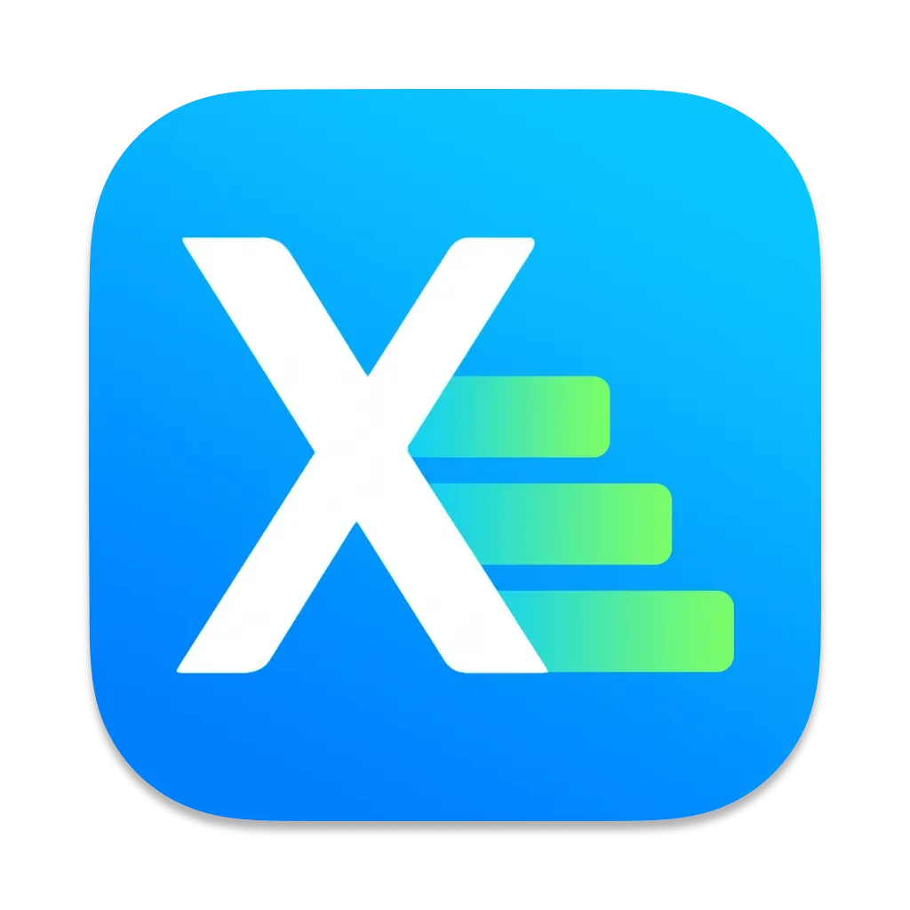

  

# Xgraph

Курсовой проект на тему: Утилита для анализа и эврестических рекомендация для многокомпонентных (многомодульных) приложений на Xcode, Swift

---

## О проекте

`Xgraph` — это утилита для **macOS**, которая анализирует Derived Data и предоставляет:

- Строит **Gantt-диаграмму** со временем сборки проекта и каждого модуля;
- Строит диаграмму связанности проекта
- Подсвечивает тип линковки (static / dynamic / unknown);
- Показывает граф зависимостей между таргетами;
- Формирует рекомендации по улучшению сборки проекта, перекомпоновки связей компонентов в проекте, сокращению критического пути сборки

---

## Минимальные требования

- **MacOS 15+** (для запуска GUI)
- Распакованные логи из **Xcode 16** (`iOS 18+`, `iPadOS 18+`, `tvOS 18+`, `watchOS 11+`, `visionOS 2+`)
- **Xcode CLI Tools** 16.0+

---

---

## Макеты

// MARK:- TODO

---

## Разработчик

[Антон Тимонин](https://github.com/timoninas)
